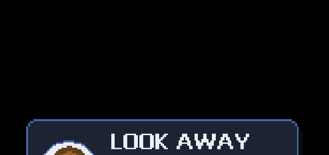
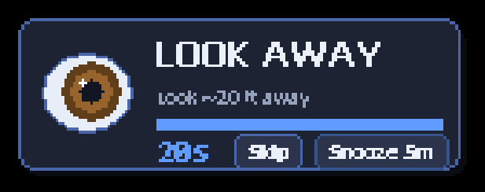
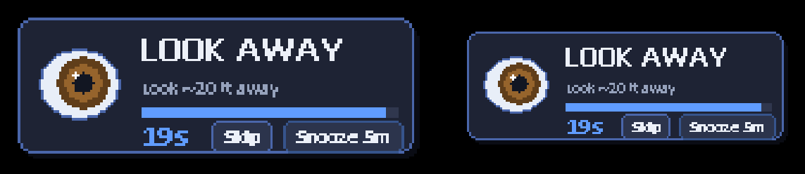
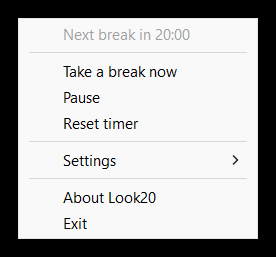

# Look20

👁️ A tiny, dependency-free **20-20-20 eye-break reminder** for Windows. Every 20 minutes an animated pixel-art eye slides onto your screen and reminds you to look ~20 feet away for 20 seconds — with a live countdown and Skip / Snooze. One self-contained `.exe`, no installer, no dependencies.

[](https://github.com/iAlturki/Look20/releases/latest/download/Look20.exe)



| At rest | Both monitors — eyes face the seam | Tray menu |
|:-:|:-:|:-:|
|  |  |  |

> The **20-20-20 rule**: every 20 minutes, look at something about 20 feet (6 m) away for at least 20 seconds to relax your eyes' focusing muscles.

## Features

- **Animated eye mascot** – a honey-brown pixel eye that blinks and glances around inside a rounded bubble, with a draining progress bar and live countdown. Everything is drawn procedurally (no image assets) so the whole app is one small `.exe`.
- **Slide-in / slide-out overlay** – a layered, slightly translucent pixel-art bubble that rises into place and retracts when done. Clicks outside the bubble pass straight through to whatever's behind it.
- **Every monitor at once** – by default the reminder mirrors onto all your monitors simultaneously, each sized to its own screen/DPI. Toggle *Show on all monitors* off to use only the screen your cursor is on.
- **"Face the shared edge" layout** (default on multi-monitor) – the eyes rest on the inner edges next to the seam between your screens, level with each other and emerging from the seam, so they land right in your central view. The slide is clipped per-monitor, so it never bleeds across the boundary.
- **Interactive** – `Skip` ends the break, `Snooze 5m` postpones it, or **drag** the bubble anywhere to set a custom position (remembered per monitor).
- **Gentle, volume-respecting chime** – uses the soft Windows notification sound (not a harsh `Beep`); fully mutable from the menu.
- **Smart pausing**
  - *Pause when I'm away* – stops counting down if you haven't touched the PC.
  - *Don't interrupt fullscreen apps* – postpones the break during games/video.
- **Configurable** work interval, break length, snooze length, sound, overlay position, all-monitor mirroring, and *Start with Windows*. Settings persist in the registry (`HKCU\Software\Look20`).
- **Single instance**, near-zero idle CPU, per-monitor-DPI aware, and the tray icon survives Explorer restarts.

## Installation

1. Download `Look20.exe` from [Releases](../../releases)
2. Run it — an eye icon appears in your system tray
3. (Optional) right-click the eye → **Settings → Start with Windows**

## Using it

- **Left-click** the tray eye → take a break right now
- **Right-click** the tray eye → settings menu (interval, break/snooze length, position, sound, …)
- During a break: click **Skip** / **Snooze 5m**, or **drag** the bubble to set a custom spot

## System requirements

- Windows 10 / 11
- A single small executable, no dependencies, minimal CPU/RAM

## Build from source

Requires a MinGW-w64 toolchain (`gcc` + `windres`). This repo was built with the MSYS2 one at `C:\msys64\mingw64\bin`.

```bat
build.bat
```

which runs:

```bat
windres app.rc -O coff -o app.res
gcc -O2 -municode -mwindows -o Look20.exe main.c app.res ^
    -lgdi32 -lshell32 -ladvapi32 -luser32 -lkernel32 -lwinmm
```

> **Note:** MSYS2's `gcc` must find its own DLLs/`cc1`, so `C:\msys64\mingw64\bin` has to be on `PATH` while building — `build.bat` adds it for you.

The result is a single `Look20.exe` with the icon, manifest (PerMonitorV2 DPI awareness + visual styles) and version info embedded. No runtime DLLs required.

| File           | Purpose                                            |
|----------------|----------------------------------------------------|
| `main.c`       | Everything: tray, overlay, animation, settings     |
| `resource.h`   | Resource / menu-command ids                        |
| `app.rc`       | Icon, manifest and version resources               |
| `app.manifest` | DPI awareness (PerMonitorV2) + Common Controls v6  |
| `icon.ico`     | App / tray icon (a pixel eye)                      |
| `build.bat`    | One-click MinGW build                              |

## License

MIT © 2026 iALTURKi — see [LICENSE](LICENSE), [NOTICE](NOTICE), and [AUTHORS](AUTHORS). If you fork or redistribute, keep the copyright notice and attribution intact.
