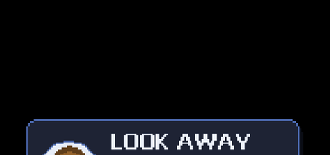
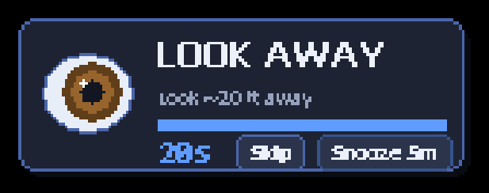
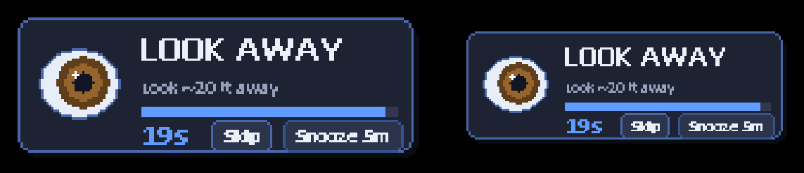
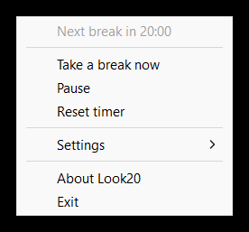

# Look20

👁️ A tiny, dependency-free **20-20-20 eye-break reminder** for Windows. Every 20 minutes an animated pixel-art eye slides onto your screen and reminds you to look ~20 feet away for 20 seconds — with a live countdown and Skip / Snooze. One self-contained `.exe`, no installer, no dependencies.

[](https://github.com/iAlturki/Look20/releases/latest/download/Look20.exe)



| At rest | Both monitors — eyes face the seam | Tray menu |
|:-:|:-:|:-:|
|  |  |  |

> The **20-20-20 rule**: every 20 minutes, look at something about 20 feet (6 m) away for at least 20 seconds to relax your eyes' focusing muscles.

## Features

- **Animated eye mascot** – a honey-brown pixel eye that blinks and glances around inside a rounded bubble, with a draining progress bar and live countdown. The overlay and the tray icon are drawn procedurally (no image assets), so the whole app is one small `.exe`.
- **Slide-in / slide-out overlay** – a layered, slightly translucent pixel-art bubble that rises into place and retracts when done. Clicks outside the bubble pass straight through to whatever's behind it.
- **Every monitor at once** – by default the reminder mirrors onto all your monitors simultaneously, each sized to its own screen/DPI. Toggle *Show on all monitors* off to use only the screen your cursor is on.
- **"Face the shared edge" layout** (default on multi-monitor) – the eyes rest on the inner edges next to the seam between your screens, level with each other and emerging from the seam, so they land right in your central view. The slide is clipped per-monitor, so it never bleeds across the boundary.
- **Interactive** – `Skip` ends the break, `Snooze 5m` postpones it, or **drag** the bubble anywhere to set a custom position (one position relative to the work area, applied on every monitor; if it would land off-screen it falls back to the bottom-right corner).
- **Gentle, volume-respecting chime** – uses the soft Windows notification sound (not a harsh `Beep`); fully mutable from the menu.
- **Smart pausing**
  - *Pause when I'm away* – stops counting down if you haven't touched the PC.
  - *Don't interrupt fullscreen apps* – postpones the break during games/video.
- **Configurable** work interval, break length, snooze length, sound, overlay position, all-monitor mirroring, and *Start with Windows*. Settings persist in the registry (`HKCU\Software\Look20`).
- **Single instance**, near-zero idle CPU, per-monitor-DPI aware, and the tray icon survives Explorer restarts.

## Installation

1. Download `Look20.exe` from [Releases](../../releases)
2. Run it — an eye icon appears in your system tray
3. (Optional) right-click the eye → **Settings → Start with Windows**

> **Antivirus / SmartScreen:** Look20 is a tiny **unsigned** indie executable, so Windows SmartScreen may show an "unknown publisher" prompt the first time — click **More info → Run anyway**. The release binary is built with MSVC and a static C runtime, which avoids the antivirus false positive the earlier MinGW build triggered. Verify the download if you like — v1.0.0 `Look20.exe` SHA-256:
> `32A3D982D54D7C39797A0B5D6D49447E1E6A2EA3C97AEF21E67EE65CB51F77D9`

## Using it

- **Left-click** the tray eye → take a break right now
- **Right-click** the tray eye → settings menu (interval, break/snooze length, position, sound, …)
- During a break: click **Skip** / **Snooze 5m**, or **drag** the bubble to set a custom spot

## System requirements

- Windows 10 / 11
- A single small executable, no dependencies, minimal CPU/RAM

## Build from source

Run `build.bat` (double-click it or run it from a terminal). It finds Visual Studio through `vswhere`, loads `vcvars64.bat`, and builds with MSVC and the static C runtime:

```bat
rc /nologo /fo app.res app.rc
cl /nologo /O2 /W3 /MT /D_CRT_SECURE_NO_WARNINGS /Fe:Look20.exe main.c app.res ^
   user32.lib shell32.lib gdi32.lib advapi32.lib winmm.lib ^
   /link /SUBSYSTEM:WINDOWS /MANIFEST:NO
```

If Visual Studio isn't installed it falls back to MinGW-w64 from MSYS2 (`C:\msys64\mingw64\bin`), with `windres` and `gcc -O2 -municode -mwindows`. Releases use the MSVC build: unsigned MinGW GUI executables tend to trip antivirus heuristics.

The result is a single `Look20.exe` with the icon, manifest (PerMonitorV2 DPI awareness + visual styles) and version info embedded. No runtime DLLs required.

## How it works

- **Pixel art on purpose.** The bubble is drawn into a 160x58 memory DC and enlarged with nearest-neighbour `StretchBlt` to each monitor's DPI. Magenta is the colour key, so those pixels are invisible and click-through.
- **Face the seam.** On a multi-monitor desk the bubbles rest next to the seam between screens and slide out from behind it. Every animation frame clips the window to its home monitor with `SetWindowRgn`, so the part still over the neighbour is never drawn ([`ClipOverlayToHome`](https://github.com/iAlturki/Look20/blob/ba739ef879be90836b76e51dc25cbf4401afd404/main.c#L1013-L1026)).
- **A bug caught before release.** On a 120 DPI screen next to a 96 DPI one, `WM_DPICHANGED` fired mid-slide and rescaled an already-scaled window from 585 to 731 px. It is now honoured only while the bubble rests ([`main.c`, lines 1110 to 1126](https://github.com/iAlturki/Look20/blob/ba739ef879be90836b76e51dc25cbf4401afd404/main.c#L1110-L1126)).
- **Idle cost.** A 1 Hz timer counts the work interval; the 16 ms animation timer runs only during a break. Measured on the author's machine over 40 hours: about 0.03% of one core, and a GDI handle count that stayed flat (peak 36).

More notes: [444005129.xyz](https://444005129.xyz/#look20).

| File           | Purpose                                            |
|----------------|----------------------------------------------------|
| `main.c`       | Everything: tray, overlay, animation, settings     |
| `resource.h`   | Resource / menu-command ids                        |
| `app.rc`       | Icon, manifest and version resources               |
| `app.manifest` | DPI awareness (PerMonitorV2) + Common Controls v6  |
| `icon.ico`     | App / tray icon (a pixel eye)                      |
| `build.bat`    | One-click build: MSVC if installed, else MinGW     |

## License

MIT © 2026 iALTURKi — see [LICENSE](LICENSE), [NOTICE](NOTICE), and [AUTHORS](AUTHORS). If you fork or redistribute, keep the copyright notice and attribution intact.
